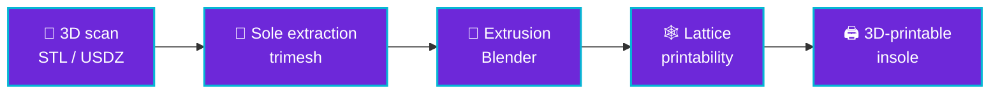

 

---

## 👋 About me

Two degrees at once: **Artificial Intelligence Engineering** at Universidad de San Andrés and **Computer Science** at UBA (Exactas). I graduated from Escuela Técnica ORT (ICT track, 2021–2025).

Curious, self-taught, and happiest when I'm **making something work better**. I like mixing theory with practice: AI, ML, computer vision, and systems with hardware, sensors and data. Hackathons, competitions and multidisciplinary teams are my natural habitat.

| 🎓 **2** degrees | 🏆 **OIA** top 20 nationally | 🚀 **NASA** Space Apps 2025 | 🧩 **5** featured projects |
|:---:|:---:|:---:|:---:|

---

## 🛠️ Stack

**Languages**

<table>
<tr>
<td align="center" width="110"> <b>Python</b></td>
<td align="center" width="110"> <b>C++</b></td>
<td align="center" width="110"> <b>JavaScript</b></td>
</tr>
</table>

**Machine learning & data**

<table>
<tr>
<td align="center" width="110"> <b>TensorFlow</b></td>
<td align="center" width="110"> <b>Keras</b></td>
<td align="center" width="110"> <b>scikit-learn</b></td>
<td align="center" width="110"> <b>pandas</b></td>
<td align="center" width="110"> <b>NumPy</b></td>
<td align="center" width="110"> <b>Jupyter</b></td>
</tr>
</table>

**3D, hardware & backend**

<table>
<tr>
<td align="center" width="110"> <b>Blender</b></td>
<td align="center" width="110"> <b>Arduino</b></td>
<td align="center" width="110"> <b>ESP32</b></td>
<td align="center" width="110"> <b>Node.js</b></td>
<td align="center" width="110"> <b>Git</b></td>
</tr>
</table>

---

## 🚀 Featured projects

**Custom orthotic insoles from a 3D foot scan.** The goal: scan your foot at home, in minutes, with no extra hardware or specialist, and get a custom insole model in seconds. Custom insoles are normally expensive and need dedicated equipment; TREVIAN automates that step. We exhibited at **MVPexperience (Nov 2025)** and got very positive feedback from visitors from the sector.

Built with trimesh, Open3D, scikit-learn, Blender (bpy) and the Google Drive API. Orientation normalization (PCA / ICP) is under research. The repo contains the generation pipeline; the mobile scanning app is not part of it.

**[→ matiszpek/TREVIAN](https://github.com/matiszpek/TREVIAN)**

 

<table>
<tr>
<td width="50%" valign="top">

Classifies exoplanet candidates from public **NASA Kepler / TESS / K2 catalogs**. Built by a team of three in one weekend for *"A World Away: Hunting for Exoplanets with AI"*, and recognized by the challenge.

`Random Forest` `Extra Trees` `AdaBoost` `Stacking`

**[→ Exoplanet-detection-using-AI](https://github.com/matiszpek/Exoplanet-detection-using-AI)**

</td>
<td width="50%" valign="top">

A personal learning project: a vision model that detects players and the ball in semi-professional matches to derive **possession, xG, passes, heat maps and speed**.

`Detection` `Football analytics`

</td>
</tr>
<tr>
<td width="50%" valign="top">

Turns photos of **hand-drawn views** of an object into a 3D model: machine vision digitizes the drawings, a custom reconstruction algorithm builds the shape (voxels, shaders, 3D algorithms).

**[→ Proyecto-4to](https://github.com/matiszpek/Proyecto-4to)**

</td>
<td width="50%" valign="top">

An RC drift car covered in **addressable NeoPixel LEDs**, with a custom desktop/web app to design the light pattern in real time. Arduino + nRF24L01, later ESP32 + ESP-NOW. 3D-printed parts.

`C++` `Node.js` `WebSocket`

**[→ Proyecto3ro](https://github.com/matiszpek/Proyecto3ro)**

</td>
</tr>
</table>

---

## 🧭 Journey

| 2023 | 2024 | 2025 | Now |
|:---:|:---:|:---:|:---:|
| 🏎️ **[NeoDrift](https://github.com/matiszpek/Proyecto3ro)** RC car with NeoPixel LEDs | ✏️ **[223D](https://github.com/matiszpek/Proyecto-4to)** drawings → 3D (Jul–Dec) 🥇 OIA 20th nationally 🎯 Math & Literature Olympiad final 🤝 President of BBYO Argentina | 🪐 **[EXODIA](https://github.com/matiszpek/Exoplanet-detection-using-AI)** NASA Space Apps 🦶 **[TREVIAN](https://github.com/matiszpek/TREVIAN)** (from Apr) 🎤 MVPexperience (Nov) 🎓 ORT graduate 🧑‍🏫 Madrij at Sociedad Hebraica | 🎓 AI Engineering + CS ⚽ **xG SHA** in development |

---

## 🏆 Recognition

-f59e0b?style=for-the-badge)

-6d28d9?style=for-the-badge)

---

## 🤝 Leadership & languages

**Madrij** (non-formal educator and leader of children and youth) at Sociedad Hebraica Argentina since 2025 · former **President of BBYO Argentina** (2024–2025).

---

## 📊 GitHub

---

### 💬 Let's build something

🇦🇷 Versión en español

 

**Matías Ariel Szpektor** — IA / Machine Learning, visión por computadora, optimización y hardware + software. Buenos Aires, Argentina.

Curso en simultáneo **Ingeniería en Inteligencia Artificial** (UdeSA) y **Licenciatura en Ciencias de la Computación** (UBA – Exactas); egresé de la Escuela Técnica ORT (orientación TIC, 2021–2025). Soy curioso, autodidacta y apasionado por la optimización; me interesa la intersección entre IA, ML, visión por computadora y ciencias de la computación, combinando teoría y práctica (incluyendo hardware, sensores y datos).

**Proyectos destacados:** **TREVIAN** (plantillas ortopédicas a medida desde un escaneo 3D del pie; expositores en MVPexperience, nov 2025) · **EXODIA** (detección de exoplanetas con ML, NASA Space Apps 2025) · **xG SHA** (análisis de fútbol desde video, en desarrollo) · **223D** (dibujos a mano → modelos 3D) · **NeoDrift** (auto RC de derrape con LEDs NeoPixel).

**Reconocimientos:** OIA puesto 20 nacional (2024) · reconocimiento NASA Space Apps 2025 · final nacional de la Olimpiada de Matemática y Literatura (2024).
**Liderazgo:** Madrij en Sociedad Hebraica Argentina; ex presidente de BBYO Argentina.

